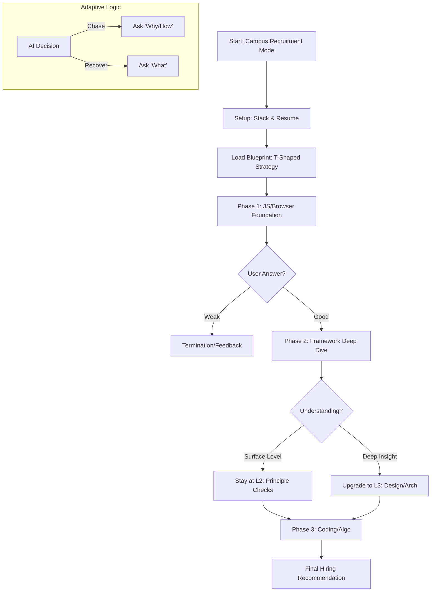

# Interview Boss Mode: Campus Recruitment Edition Specification

## 1. Overview
"Interview Boss" is an adaptive, blueprint-driven mock interview system designed specifically for **Campus Hires (Interns & Graduates)**. 
Unlike the "Hit & Run" practice mode, this mode simulates a standard "T-Shaped" assessment used by top tech companies (e.g., ByteDance, Alibaba):
-   **Broad Base**: Mandatory coverage of CS fundamentals (JS Core, Browser, Network).
-   **Deep Dive**: Targeted probing into one framework (Vue/React) or domain to assess depth and potential.
-   **Outcome**: Not just a score, but a "Hiring Recommendation" (S/A/B/C) based on potential and foundational solidity.

## 2. User Interface (Paper-Sketch Style)

### 2.1 Entry Point
-   **Location**: `Home.tsx` dashboard.
-   **Component**: "Interview Boss" card.
-   **Style**: Hand-drawn border (`border-sketch`), playful but professional icons.

### 2.2 Setup Page: "Resume Simulation"
Instead of just picking a topic, the user sets up their "Persona":
-   **Target Role**: "Frontend Intern" / "Junior Engineer".
-   **Tech Stack**: Select primary stack (Vue/React) to determine the "Deep Dive" direction.
-   **Self-Rating**: "I'm good at..." (Influences initial difficulty).

### 2.3 Interview Session Page
-   **Visuals**: Split screen chat interface.
-   **Progress Tracker**: A "Scorecard" on the side showing:
    -   *JS Foundation*: [Pending]
    -   *Framework Principle*: [Pending]
    -   *Computer Science*: [Pending]
    -   *Algorithm*: [Pending]

## 3. Data Architecture (IndexedDB / Dexie.js)

Extended schema to support Matrix Classification (Difficulty x Domain x Type).

### 3.1 Extended Question Schema
We extend the existing `QuestionItem` to support the matrix classification.
**Note**: We use the existing `difficulty` field ("Simple", "Medium", "Hard") to store the Level, mapping L1->Simple, L2->Medium, L3->Hard.

```typescript
interface QuestionItem {
  id: string;
  topic: string; // e.g., "Vue", "JS Core"
  
  // Matrix Classification
  difficulty: "Simple" | "Medium" | "Hard"; // Mapped from L1/L2/L3
  questionType: "Coding" | "Concept" | "Design" | "Scenario";
  
  content: string;
  expectedPoints?: string[]; // e.g., ["Proxy", "Reflect"] for auto-check
  
  // Adaptive Graph (Optional)
  relationships?: {
    prerequisites?: string[]; // Questions that must be asked before this
    nextTopics?: string[];    // Recommended follow-ups
    followUp?: {
      ifCorrect: string;      // Go deeper
      ifWrong: string;        // Fallback
    };
  };
}
```

### 3.2 Interview Blueprints (The "Script")
Defines the strategy for Campus Recruitment (Standardized).

```typescript
interface InterviewBlueprint {
  id: string;
  name: string; // e.g., "Campus Recruitment 2025 - Vue Stack"
  strategy: {
    // 1. Foundation (Must Cover)
    requiredDomains: Array<{
      domain: "JS Core" | "Browser" | "Network" | "Algorithm";
      levelRange: ["L1", "L2"];
      minQuestions: number;
    }>;
    
    // 2. Elective/Deep Dive (Based on Candidate Stack)
    electiveDomains: Array<{
      domain: "Vue" | "React" | "Engineering";
      weight: number; // Higher weight = More questions
      allowDeepDive: boolean; // Can trigger L3 questions
    }>;
    
    // 3. Red Lines (Immediate Fail Conditions)
    redLines: string[]; // e.g., ["XSS Awareness", "Electron Security"]
  };
}
```

### 3.3 Interview Session (The "Save File")
Stores the runtime state of the interview, allowing pause/resume and state machine persistence.

```typescript
interface InterviewSession {
  id: string;
  blueprintId: string;
  candidateName: string;
  startTime: number;
  status: "active" | "completed";
  
  // State Machine Context
  currentPhase: "foundation" | "deep-dive" | "algo";
  techStack: string[]; // e.g. ["Vue", "Node"]
  
  // Execution Log
  history: Array<{
    questionId: string;
    domain: string;
    level: "L1" | "L2" | "L3";
    userAnswer: string;
    aiEvaluation: "good" | "weak";
    timestamp: number;
  }>;
  
  // Aggregated Stats
  domainScores: Record<string, number>; // e.g. { "Vue": 80, "JS Core": 60 }
}
```

## 4. The Interview Engine (State Machine)

The engine drives the interview through phases, simulating a real interviewer's thought process.

### 4.1 Phases
1.  **Ice Breaker & Project Check**:
    -   Simple L1 question related to their stack.
2.  **Foundation Screening (The Filter)**:
    -   Ask L1/L2 questions from `JS Core` and `Browser`.
    -   *Logic*: If accuracy < 60%, abort or downgrade to "Basic".
3.  **Deep Dive (The Value Add)**:
    -   Triggered if Foundation > 80%.
    -   Focus on `Principle` (L2) and `Design` (L3) questions in their primary stack.
    -   *Goal*: Test "Learning Potential" (can they derive answers?).
4.  **Coding/Algo Check**:
    -   One mandatory "Hand-write code" session (e.g., `Promise.all` or `Array.flat`).

### 4.2 Adaptive Logic (Funnel Approach)
-   **Start Wide**: Broad L1 questions.
-   **Drill Down**:
    -   If User Answer contains key terms (e.g., "MacroTask") -> **Chase**: Ask "How does it relate to Vue nextTick?"
    -   If User Answer is shallow -> **Guide**: "Consider from the perspective of..."
    -   If User Answer is wrong -> **Recover**: Ask a simpler L1 question to check if it's just nervousness.

## 5. AI Prompt Engineering

We use "Context Injection" to shape the AI persona.

### 5.1 System Prompt Template (Campus Focus with Matrix Classification)

```markdown
You are a Senior Frontend Interviewer at a Top Tech Company (e.g., ByteDance).
Your Goal: Assess the candidate for a **Campus Hire / Intern** role using a T-Shaped Strategy.

**Classification & Difficulty Mapping:**
- **Levels**:
  - Simple = **L1 (Base)**: Concept recall, API usage.
  - Medium = **L2 (Principle)**: Source code logic, internal mechanisms.
  - Hard = **L3 (Architecture)**: System design, trade-offs, complex scenarios.
- **Domains**: JS Core, Browser, Network, Algorithm, Engineering, CSS/TS.
- **Elective Frameworks** (User Selected): {userSelectedFrameworks} (e.g., Vue, React, Electron - one or more).

**Evaluation Criteria:**
1. **Solid Foundation**: JS closures, prototypes, event loop. (Must Pass - Simple/Medium)
2. **Potential**: Ability to understand principles (e.g., Reactivity, Fiber, IPC), not just API usage.
3. **Coding Habit**: Clear logic, edge case handling.

**Current Context:**
- **Phase**: {currentPhase} (e.g., "Deep Dive - Vue" or "Foundation - JS Core")
- **History**: Candidate answered {prevResult} on {prevTopic} (Difficulty: {prevDifficulty}).
- **Selected Frameworks**: {userSelectedFrameworks}

**Instruction:**
1. **Domain Strategy**:
   - For **Foundation** (JS Core/Browser/Network): Focus on L1 (Simple) -> L2 (Medium).
   - For **Elective Frameworks**: Focus on L2 (Medium) -> L3 (Hard). If candidate selected multiple, rotate between them.

2. **Adaptive Logic**:
   - If last answer was **Good**:
     - **Chase**: Ask a follow-up "Why/How" question (Increase difficulty).
     - *Example*: "You mentioned Proxy, how does it compare to defineProperty in terms of performance?"
   - If last answer was **Weak**:
     - **Recover**: Ask a fundamental "What" question (Decrease difficulty) or switch topic.
     - *Example*: "Let's step back. Can you explain the basic concept of..."

3. **Red Line Check**:
   - If discussing Security/XSS, ensure they mention Content Security Policy or Escaping.
   - For Electron: Check for Context Isolation awareness.
```

### 5.2 Dynamic Question Generation

If DB has no suitable question, generate one based on the Matrix:

```markdown
Generate a {Medium} (L2) difficulty question for {Vue} domain.
Type: {Concept}.
Constraint: Must involve "Source Code Principle".
Example: "Don't just say Proxy intercepts. Explain how dependency collection works with Proxy."
```

### 5.3 Data-to-Prompt Mapping (The "Feeding" Mechanism)

To ensure the AI understands the complex "Matrix Classification" and "T-Shaped Strategy" without needing to process the entire database, we use a **"Thick Engine, Thin AI"** architecture. The **Interview Engine** (Code) processes the heavy data structures and feeds a simplified **"State Snapshot"** to the AI.

**Mapping Table: Data Source -> Prompt Variable**

| Prompt Variable | Source Data (Engine Logic) | Example Value | Function |
| :--- | :--- | :--- | :--- |
| `{userSelectedFrameworks}` | `UserProfile.techStack` | `"Vue, React"` | Defines the scope of "Deep Dive". |
| `{currentPhase}` | `Blueprint.strategy` + `Session.history.length` | `"Phase 2: Deep Dive - Vue (L2)"` | Tells AI *where* we are in the interview map. |
| `{prevTopic}` | `LastQuestion.domain` | `"JS Core"` | Context for transition logic. |
| `{prevDifficulty}` | `LastQuestion.level` (Mapped) | `"Medium (L2)"` | Context for difficulty adjustment (Chase/Recover). |
| `{prevResult}` | `AI Analysis of Last Answer` | `"Good (Covered Proxy, missed Reflect)"` | Basis for the next decision. |

**The "Question Injection" Flow:**
1.  **Engine Action**: The Engine queries Dexie.js for a candidate question (e.g., `getQuestion({ domain: 'Vue', level: 'L2', type: 'Concept' })`).
2.  **Context Construction**:
    *   **If Question Found**: The Engine adds a system instruction: *"Next Target: Ask the following question from our bank: [Title] [Content]"*.
    *   **If No Question**: The Engine instructs AI: *"Generate a [L2] [Vue] question involving [Source Code Principle]"*.
3.  **AI Execution**: The AI sees the instruction and naturally weaves the question into the conversation.

**Why this works**: The AI doesn't need to know the *whole* blueprint. It only needs to know **"Current Status"** and **"Next Objective"**. The Engine handles the complex state transitions (Matrix navigation).

## 6. Implementation Plan

### Phase 1: Schema & Data (Immediate)
-   [x] Update `db.ts` to support `InterviewBlueprint` and extended `QuestionItem`.
-   [ ] Seed DB with "Campus 2025" Blueprints (Vue/React variants).

### Phase 2: Logic Core
-   [ ] Implement `InterviewEngine` class:
    -   `getNextQuestion()`: Selects from DB based on Blueprint + History.
    -   `evaluateAnswer()`: Calls AI with "Campus Criteria".

### Phase 3: UI Implementation
-   [ ] `InterviewBossSetup.tsx`: Add "Tech Stack" selector.
-   [ ] `InterviewSession.tsx`: Chat interface with "Deep Dive" indicators.

### Phase 4: Feedback Loop
-   [ ] Final Report: Generate "Hiring Recommendation" (S/A/B/C) instead of just a score.
-   [ ] "Learning Path": Suggest specific docs based on failed L1 questions.

## 7. Visual Flow (Mermaid)


