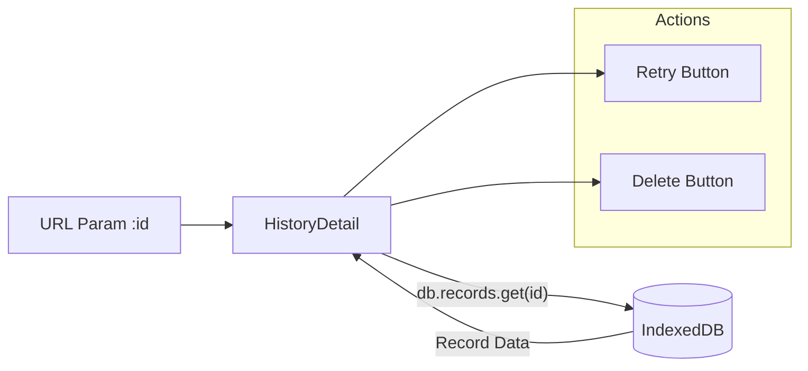

# History Detail Page Documentation

## 1. 概览 (Overview)

History Detail 页面 (`src/pages/HistoryDetail.tsx`) 是单次面试记录的深度复盘界面。它复用了面试界面的布局结构，但将状态锁定为“只读”或“回顾”模式，重点在于展示 AI 的分析报告和用户的原始代码快照。

页面风格与整体应用保持一致，采用 **手绘草图风格 (Pencil Sketch Style)**，营造专注、沉浸的复盘体验。

页面核心目标：
*   **复盘回顾**：查看当时的题目、自己的代码实现以及 AI 的评分详情。
*   **能力分析**：通过雷达图和详细评语了解薄弱环节。
*   **操作入口**：提供 "Retry" (重做) 和 "Delete" (删除) 功能。

---

## 2. 视觉与布局 (Visual & Layout)

复用 `MainLayout` 组件，保持与 Interview 页面一致的视觉体验，但移除了交互输入部分。

*   **视觉风格**:
    *   **背景**: `paper-surface` 纸质纹理。
    *   **边框**: 所有内容区域（代码编辑器、分析报告）均包裹在 `border-sketch` 手绘边框内。
    *   **字体**: 标题栏采用 `font-heading` (Playfair Display) 和 `uppercase` 设计，增强正式感与设计感。

*   **Left Panel**: `QuestionCard` - 展示题目详情。
*   **Center Panel**: `InterviewEditor` (ReadOnly) - 展示用户当时提交的代码快照，顶部带有 "Snapshot Code" 标识。
*   **Bottom Panel**: `AnalysisReport` - 展示 AI 评价、雷达图和参考答案。
*   **Header**: 显示分数 Badge 和操作按钮。

---

## 3. 数据获取 (Data Fetching)

不同于列表页依赖 Store，详情页直接根据 URL 参数 `id` 向 IndexedDB 请求数据。



---

## 4. 功能模块详解 (Features)

### 4.1 数据加载与 404 处理
*   **Loading**: 初始状态显示 "Loading Record..." 提示框（手绘风格）。
*   **Not Found**: 如果 `id` 无效或记录已被删除，显示友好的 "Record not found" 提示页，并提供 "Back to History" 按钮。

### 4.2 代码快照 (Snapshot)
*   使用 `InterviewEditor` 组件，但设置 `readOnly={true}`。
*   顶部标题栏显示 "SNAPSHOT CODE" 和 "TYPESCRIPT"，明确告知用户这是历史快照，不可编辑。

### 4.3 详细分析报告
集成 `AnalysisReport` 组件：
*   **Evaluation Tab**:
    *   **Score**: 大号字体展示总分。
    *   **Radar Chart**: 维度雷达图 (Accuracy, Completeness, Logic, Code Quality)。
    *   **Instructor Note**: 模拟便签风格的 AI 评语。
    *   **Tech Tags**: 相关的技术标签。
*   **Reference Tab**: Markdown 渲染的标准参考答案。

### 4.4 关键操作 (Actions)
位于 Header 右侧：
1.  **Retry (重做)**:
    *   跳转至 `/interview/:topic`。
    *   携带 `state` (retryMode, fixedQuestion)，强制面试页面使用当前记录的题目，跳过选题阶段。
2.  **Delete (删除)**:
    *   二次确认 (Confirm Dialog)。
    *   调用 `removeRecord(id)` 从 Store/DB 删除。
    *   成功后跳转回列表页。

---

## 5. 代码片段示例 (Code Implementation)

### 数据加载副作用
```typescript
// src/pages/HistoryDetail.tsx
useEffect(() => {
  let mounted = true;
  const run = async () => {
    if (!id) return;
    setLoading(true);
    try {
      // 直接查询 Dexie，确保获取最新数据
      const found = await db.records.get(id);
      if (!mounted) return;
      setRecord(found ?? null);
    } finally {
      if (mounted) setLoading(false);
    }
  };
  void run();
  return () => { mounted = false; };
}, [id]);
```

### 重试逻辑 (Retry Logic)
```typescript
// src/pages/HistoryDetail.tsx
navigate(`/interview/${encodeURIComponent(record.topic)}`, {
  state: {
    retryMode: true,
    topic: record.topic,
    fixedQuestion: {
      id: record.questionId ?? crypto.randomUUID(),
      content: record.questionContent,
      type: record.questionType ?? "Code",
      difficulty: normalizeDifficulty(record.difficulty),
      source: record.sourceType ?? "AI",
    },
  },
});
```
