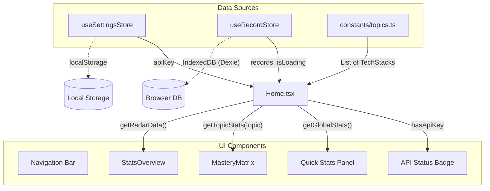

# Home Page Documentation

## 1. 概览 (Overview)

Home 页面是 "Tech Mastery Matrix" 的核心控制台，采用了 **"Digital Analog" (数字模拟/工程草图)** 的设计风格。它不仅是导航入口，更是用户当前技术掌握情况的实时仪表盘。

页面核心目标：
*   **全局导航**：提供通往练习、历史记录、资源导入和设置的快捷入口。
*   **状态概览**：即时展示 API 连接状态、累计练习题数、平均分和系统就绪状态。
*   **能力矩阵 (Mastery Matrix)**：以卡片形式展示各个技术栈（Topic）的熟练度、活跃度和快捷开始入口。
*   **技能雷达 (Skill Radar)**：可视化展示用户的技能分布（基于历史答题数据的 Tag 聚合）。

---

## 2. 设计风格 (Visual Style)

页面视觉语言模拟了“工程笔记本”的质感，旨在降低面试焦虑，营造专注、推演的氛围。

*   **背景 (Background)**: 使用 `.paper-surface` 类（见 `src/index.css`），通过 CSS 渐变模拟方格纸/网格纸纹理。
*   **边框 (Borders)**: 使用 `.border-sketch` 类，通过自定义 `border-radius` 和 `box-shadow` 模拟手绘的不规则线条感。
*   **字体 (Typography)**:
    *   **Heading**: `Playfair Display` (Serif) - 强调经典与权威感。
    *   **UI/Body**: `Montserrat` (Sans) - 保证界面清晰易读。
    *   **Accent**: `Architects Daughter` / `Patrick Hand` (Handwritten) - 用于图表标签或装饰性文字，增强手绘感。
*   **配色 (Color Palette)**:
    *   **Ink**: `#2C3E50` (深蓝灰) - 主文字色，模拟钢笔墨水。
    *   **Paper**: `#F9F7F1` (米白) - 纸张背景色。
    *   **Gold**: `#B89C66` (暗金) - 强调色/高亮色。
    *   **Status**: Emerald (Ready/High Score), Rose (Error/Low Score), Amber (Warning/Medium Score).

---

## 3. 数据架构与来源 (Data Architecture)

Home 页面的数据主要来自两个全局 Store (`Zustand`) 和一个静态常量配置。



### 3.1 核心数据源

1.  **`src/constants/topics.ts`**:
    *   **数据**: `TECH_STACKS` 数组。
    *   **用途**: 定义系统支持的技术栈列表（Vue, React, TypeScript 等），决定了 Topic Board 显示哪些卡片。
    
    ```typescript
    // src/constants/topics.ts
    export const TECH_STACKS: TechStack[] = [
      { slug: "vue", label: "Vue", icon: Triangle },
      { slug: "react", label: "React", icon: Atom },
      // ...
    ];
    ```

2.  **`src/store/useSettingsStore.ts`**:
    *   **数据**: `apiKey`。
    *   **用途**: 判断用户是否已配置 AI 密钥，从而在顶栏显示 "API READY" 或 "API REQUIRED"。
    *   **持久化**: `localStorage`.

3.  **`src/store/useRecordStore.ts`**:
    *   **数据**: `records` (所有历史面试记录)。
    *   **用途**: 提供计算统计数据的方法。
    *   **持久化**: `IndexedDB` (via `Dexie.js`).
    
    关键 Hook 方法:
    *   `loadRecords()`: 初始化时从 DB 加载数据。
    *   `getGlobalStats()`: 计算总题数 (`totalQuestions`) 和全局平均分 (`globalAverage`)。
    *   `getTopicStats(topic)`: 计算特定技术栈的练习次数、平均分、最后活跃时间。
    *   `getRadarData()`: 聚合 `techTags` 生成雷达图数据。

---

## 4. 功能模块详解 (Features)

### 4.1 顶部导航栏 (Navigation)

*   **Logo**: 点击重置回首页。
*   **Menu**: 包含 "练习 (Practice)", "记录 (History)", "导入题库 (Resources)" 的快速跳转。
*   **API Status**:
    *   状态胶囊 (`role="status"`)：
        *   **Green (API READY)**: `apiKey` 存在。
        *   **Red (API REQUIRED)**: `apiKey` 为空。
    *   **Settings Button**: 点击跳转 `/settings`。

### 4.2 统计概览 (Quick Actions & Stats)

位于左侧栏 (`lg:col-span-3`)，包含两个卡片：

1.  **Quick Start**: 提供 "New Sketch" 按钮，锚点跳转到 Topic Board。
2.  **Global Stats**:
    *   **Questions**: `globalStats.totalQuestions` - 累计练习过的题目总数。
    *   **Average Score**: `globalStats.globalAverage` - 所有评分的平均值。
    *   **Pulse Status**: 系统状态指示灯。
        *   `isLoading` (Amber): 正在从 IndexedDB 加载数据或进行计算。
        *   `Online` (Emerald): 数据就绪。

### 4.3 主题题板 (Topic Board / Mastery Matrix)

位于中间核心区域 (`lg:col-span-6`)。

*   **实现**: 遍历 `TECH_STACKS`，为每个 Tech 生成一个 `TechPanel`。
*   **数据注入**: 使用 `getStatsForMatrix` 回调，实时获取每个 Topic 的状态。
    ```typescript
    // src/pages/Home.tsx
    const getStatsForMatrix = useCallback(
      (topicLabel: string) => {
        const s = getTopicStats(topicLabel);
        return { 
          count: s.count, 
          avgScore: s.avgScore, 
          lastActive: formatLastActive(s.lastTimestamp) 
        };
      },
      [getTopicStats],
    );
    ```
*   **交互**: 点击卡片 -> 跳转 `/interview/:slug` 开始面试。
*   **视觉反馈**:
    *   **NEW**: 练习次数为 0。
    *   **MED/HARD/EASY**: 根据平均分动态显示难度标签颜色。
    *   **进度条**: 卡片底部显示该技术的平均分进度条。

### 4.4 技能雷达 (Stats Overview / Radar)

位于右侧栏 (`lg:col-span-3`)。

*   **组件**: `StatsOverview` -> `Recharts RadarChart`。
*   **数据逻辑**:
    *   优先展示用户的前 8 个高频 `techTags` (如 "Hooks", "Async", "DOM" 等)。
    *   如果数据不足，回退显示默认的 6 个基础维度 (Vue, React, TS, JS, CSS, Node)。
    *   数据由 `useRecordStore.getRadarData()` 实时聚合计算。

---

## 5. 代码片段示例 (Code Implementation)

### 初始化数据加载
Home 组件挂载时，触发 IndexedDB 数据加载：

```typescript
// src/pages/Home.tsx
useEffect(() => {
  void loadRecords(); // 触发 Zustand action 从 Dexie 加载数据
}, [loadRecords]);
```

### 计算统计摘要
利用 `useMemo` 避免每次渲染都重算统计信息：

```typescript
// src/pages/Home.tsx
const topicSummary = useMemo(() => {
  let active = 0;
  TECH_STACKS.forEach((tech) => {
    const stats = getTopicStats(tech.label);
    if (stats.count > 0) active += 1;
  });
  return { active, total: TECH_STACKS.length };
}, [getTopicStats]);
```

### API 状态检查
```typescript
// src/pages/Home.tsx
const apiKey = useSettingsStore((s) => s.apiKey);
const hasApiKey = Boolean(apiKey);

// ... JSX 渲染
<span
  role="status"
  aria-label={hasApiKey ? "API 已连接" : "API 未配置"}
  className={cn(/* 动态颜色类名 */)}
>
  {/* 状态指示点与文案 */}
</span>
```
