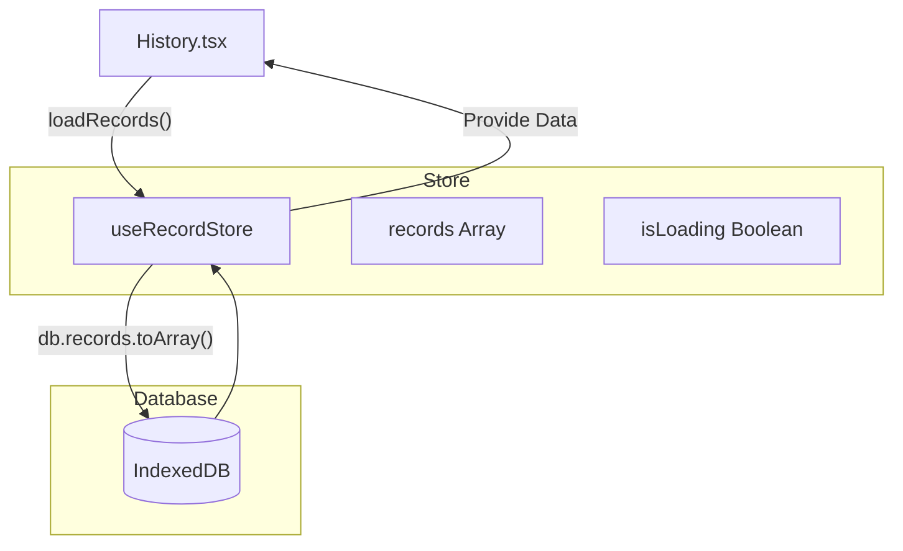

# History Page Documentation

## 1. 概览 (Overview)

History 页面 (`src/pages/History.tsx`) 是用户练习历程的档案室。它采用了与首页一致的**手绘草图风格 (Pencil Sketch Style)**，以网格卡片流的形式展示所有历史面试记录，允许用户回顾、筛选并重启过去的练习。

页面核心目标：
*   **记录归档**：展示所有已完成的面试记录，包括得分、时间、题目摘要等信息。
*   **筛选检索**：支持按技术栈 (Topic) 快速筛选记录。
*   **状态回顾**：通过颜色编码 (Success/Warning/Destructive) 直观展示每次练习的表现等级。

---

## 2. 交互与视觉设计 (Visual & Interaction)

*   **视觉风格**:
    *   **背景**: `paper-surface` 纸质纹理背景。
    *   **字体**: 标题使用 `Playfair Display`，正文使用 `Montserrat`，强调手绘与笔记感。
    *   **边框**: 统一使用 `border-sketch` 手绘风格边框，带有非对称圆角和独特的阴影效果。

*   **布局**: 响应式网格布局，适配不同屏幕尺寸。
*   **卡片**: 每个 `HistoryCard` 是一个交互单元。
    *   **Hover**: 悬停时整体上浮 (`-translate-y-0.5`) 并加深阴影，提示可点击。
    *   **Topic Icon**: 不同技术栈对应专属颜色图标 (e.g., React=SkyBlue, Vue=Emerald)。
*   **空状态**: 当无记录时，展示带有手绘图标的引导界面，提供 "Start Practice" 按钮。

---

## 3. 数据架构 (Data Architecture)

数据主要由 `useRecordStore` 管理，底层依赖 IndexedDB。



### 3.1 核心数据流
1.  **加载**: 页面挂载时调用 `loadRecords()`，异步从 IndexedDB 拉取所有记录。
2.  **筛选**: 前端基于 `records` 数组进行内存筛选 (`filteredRecords`)，避免频繁查询数据库。
    *   **Topic List**: 动态计算所有记录中出现过的 Topic 集合，用于生成下拉菜单。

---

## 4. 功能模块详解 (Features)

### 4.1 顶部工具栏
*   **Navigation**: 保持与 Home 页一致的顶部导航栏，提供 "PRACTICE", "HISTORY", "IMPORT QUESTIONS" 快速入口。
*   **Filter & Actions**:
    *   **Topic Filter**: 带有手绘边框的下拉菜单，默认 "All"。
    *   **Refresh**: 手绘风格的方形按钮，手动触发 `loadRecords()`。

### 4.2 历史记录列表
使用 `HistoryCard` 组件渲染单个条目：
*   **Visual**: 白色卡片背景 + `border-sketch` 边框。
*   **Score Badge**: 右上角展示分数 Badge。
*   **Content**: 展示题目摘要 (截取前 80 字符) 和相对时间 (e.g., "2 hours ago")。
*   **Progress**: 底部细条进度条，颜色与分数等级对应。

### 4.3 路由导航
*   点击卡片 -> `navigate(/history/:id)` -> 进入详情页。

---

## 5. 代码片段示例 (Code Implementation)

### 动态 Topic 聚合与筛选
利用 `useMemo` 确保筛选逻辑高效执行：

```typescript
// src/pages/History.tsx

// 1. 聚合去重 Topic 列表
const topics = useMemo(() => {
  const set = new Set<string>();
  for (const r of records) set.add(r.topic);
  return ["All", ...[...set].sort((a, b) => a.localeCompare(b))];
}, [records]);

// 2. 根据选中的 Topic 过滤记录
const filteredRecords = useMemo(() => {
  if (filterTopic === "All") return records;
  return records.filter((r) => r.topic === filterTopic);
}, [filterTopic, records]);
```

### 卡片列表渲染
```typescript
// src/pages/History.tsx
{
 filteredRecords.map((record) => (
  <HistoryCard 
    key={record.id} 
    record={record} 
    onClick={() => navigate(`/history/${record.id}`)
  />
))
	}
```
