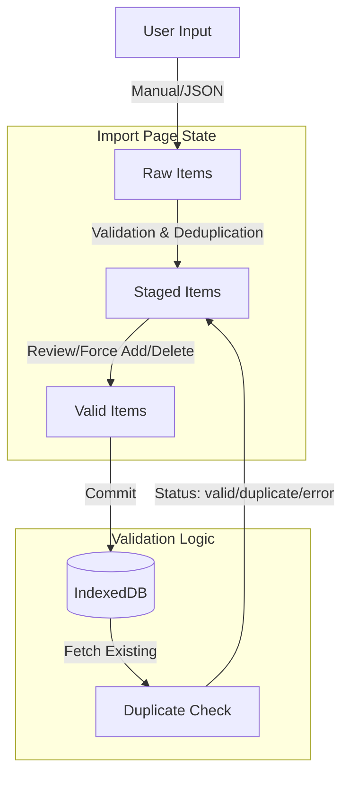

# Import Page Documentation

## 1. 概览 (Overview)

Import 页面 (`src/pages/Import.tsx`) 是题库扩充的入口，采用了与 Home 页面一致的 **"Digital Analog" (数字模拟/工程草图)** 设计风格。它允许用户通过手动录入或 JSON 批量粘贴的方式，将新的面试题目导入到本地数据库 (`IndexedDB`)。

页面核心目标：
*   **多源输入**：支持 "Manual Entry" (手动录入) 和 "JSON Batch" (批量粘贴) 两种模式。
*   **预处理与校验**：在写入数据库前，提供暂存区 (`Staging Area`) 进行去重 (`Duplicate Check`) 和格式校验。
*   **安全写入**：确保只有校验通过的数据才能被写入，防止脏数据污染题库。

---

## 2. 视觉与布局 (Visual & Layout)

*   **视觉风格**:
    *   **背景**: `paper-surface` 纸质纹理背景。
    *   **边框**: `border-sketch` 手绘风格边框，用于包裹输入区和暂存区。
    *   **字体**: 标题使用 `Playfair Display`，正文使用 `Montserrat`，强调手绘与笔记感。

*   **布局**:
    *   **Navigation**: 复用全局导航栏。
    *   **Header**: 页面标题与 "Save to Database" 核心操作按钮。
    *   **Input Section**: 提供模式切换 (Manual/JSON) 和对应的表单/输入框。
    *   **Staging Area**: 展示待写入的题目列表，支持删除和强制添加。

---

## 3. 数据架构 (Data Architecture)

Import 页面的数据流主要在内存中处理，最后一次性写入 `IndexedDB`。



### 3.1 核心状态
*   `mode`: 当前输入模式 (`"manual" | "json"`).
*   `stagedItems`: 暂存区列表，包含校验状态 (`valid`, `duplicate`, `error`)。
*   `isCommitting`: 写入状态锁，防止重复提交。

---

## 4. 功能模块详解 (Features)

### 4.1 输入源 (Input Source)
*   **Manual Entry**:
    *   提供 Topic, Difficulty, Type 下拉选择。
    *   Markdown 内容编辑器。
*   **JSON Batch**:
    *   支持粘贴 JSON 数组。
    *   自动识别并剥离 Markdown 代码块围栏 (````json ... ````)。
    *   支持字段模糊匹配 (e.g., `type`/`questionType`/`Type`)。

### 4.2 校验逻辑 (Validation)
在加入暂存区时触发：
1.  **去重**: 计算 `content` 的哈希值，与数据库中已有的同 Topic 题目比对。
2.  **必填检查**: 确保 `topic`, `content` 不为空。
3.  **结果分类**:
    *   `valid`: 新题目，可直接写入。
    *   `duplicate`: 库中已存在完全一致的题目（Topic + Content）。
    *   `error`: 数据格式错误。

### 4.3 暂存区 (Staging Area)
*   **展示**: 列出所有解析后的题目。
*   **状态徽章**:
    *   **Valid** (Green): 准备就绪。
    *   **Duplicate** (Amber): 重复项，默认不写入。
    *   **Error** (Red): 错误项。
*   **操作**:
    *   **Force Add**: 将 `duplicate` 状态强制改为 `valid` (允许创建重复题)。
    *   **Remove**: 从暂存区移除。

### 4.4 提交 (Commit)
*   点击 "Save to Database" 按钮。
*   过滤出所有 `status === "valid"` 的条目。
*   批量写入 `db.questions` 表。
*   成功后清空暂存区中的已写入项，保留未处理的错误项。

---

## 5. 代码片段示例 (Code Implementation)

### 写入数据库事务
```typescript
// src/pages/Import.tsx

const commit = useCallback(async () => {
  const items = stagedItems.filter((i) => i.status === "valid");
  if (!items.length) return;

  setIsCommitting(true);
  try {
    const now = Date.now();
    // 构造写入数据
    const toInsert: QuestionItem[] = await Promise.all(
      items.map(async (s) => {
        const normalizedContent = s.payload.content.trim();
        const contentHash = await computeContentHash(s.payload.topic, normalizedContent);
        return {
          id: crypto.randomUUID(),
          contentHash,
          topic: s.payload.topic,
          content: normalizedContent,
          // ...其他字段
          createdAt: now,
        };
      }),
    );

    // 批量写入
    await db.questions.bulkAdd(toInsert);
    toast.success(`Successfully imported ${toInsert.length} questions`);
    
    // 清理暂存区
    setStagedItems((prev) => prev.filter((i) => i.status !== "valid"));
  } catch (err) {
    toast.error(`Import failed: ${message}`);
  } finally {
    setIsCommitting(false);
  }
}, [stagedItems]);
```
