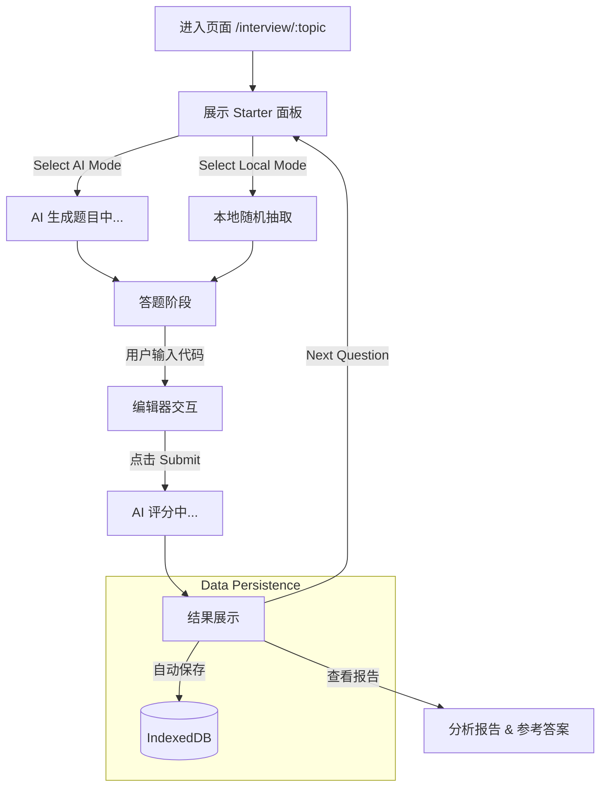

# Interview Page Documentation

## 1. 概览 (Overview)

Interview 页面 (`src/pages/Interview.tsx`) 是 "Tech Mastery Matrix" 的核心训练场，为用户提供沉浸式的模拟面试环境。它支持从 AI 实时获取题目或从本地题库随机抽取，并提供代码编辑、实时评分和详细的反馈报告。

页面核心目标：
*   **沉浸式答题**：最小化干扰的编辑器环境，支持 Markdown 题目渲染。
*   **双模题源**：
    *   **AI Auto-Generate**: 基于所选技术栈（如 React, Vue），由 AI 实时生成面试题。
    *   **Local Database**: 从用户导入的题库中随机抽取，适合离线练习。
*   **即时反馈**：提交答案后，AI 会从准确性、完整性、逻辑性和代码质量四个维度进行打分和点评。

---

## 2. 交互流程 (Workflow)

页面采用严格的“状态机”模式来管理面试流程，但优化了初始体验，允许用户先进入沉浸式布局。



---

## 3. 核心组件 (Core Components)

页面基于 `MainLayout` 构建，分为三个主要交互区域：

### 3.1 布局容器 (`MainLayout`)
*   **功能**: 提供统一的顶部导航（返回按钮、进度条）、侧边栏（题目信息）和主工作区（编辑器/结果）。
*   **进度条**: 顶部进度条根据当前 `step` 动态变化 (0% -> 25% -> 50% -> 75% -> 100%)。

### 3.2 启动器与题目卡片 (`InterviewStarter` & `QuestionCard`)
*   **位置**: 布局左侧 (Desktop) 或 顶部 (Mobile)。
*   **状态切换**:
    *   **INIT 阶段**: 显示 `InterviewStarter`。提供 "AI Auto-Generate" 和 "Local Database" 的非阻塞式选择面板。
    *   **ANSWERING 阶段**: 显示 `QuestionCard`。
*   **QuestionCard 内容**:
    *   **Meta**: 题目来源 (AI/Local)、类型 (Code/Theory)、难度 (Simple/Medium/Hard)。
    *   **Content**: 支持 Markdown 渲染的题目描述。

### 3.3 代码编辑器 (`InterviewEditor`)
*   **位置**: 布局右侧核心区域。
*   **双模式**:
    *   **Monaco Mode**: 全功能代码编辑器，支持语法高亮、自动补全（桌面端默认）。
    *   **Text Mode**: 简易文本框，适合移动端或纯文本输入。
*   **自适应**: 移动端强制降级为 Text Mode 以优化体验。

### 3.4 分析报告 (`AnalysisReport`)
*   **触发**: 提交答案后显示。
*   **内容**:
    *   **Radar Chart**: 准确性、完整性、逻辑、代码质量的雷达图。
    *   **Score**: 总分展示。
    *   **Feedback**: AI 生成的详细评价和改进建议。
    *   **Reference**: 参考答案（Tab 切换）。

---

## 4. 数据流与状态管理 (State Management)

### 4.1 内部状态 (Local State)
使用 `useReducer` 管理复杂的面试步骤状态，避免 `useState` 爆炸。

```typescript
type InterviewStep = "INIT" | "LOADING_QUESTION" | "ANSWERING" | "ANALYZING" | "RESULT";

type State = {
  step: InterviewStep;
  topic: string;
  source: QuestionSource | null; // 'AI' | 'Local'
  questionData: QuestionData | null;
  userCode: string;
  analysisResult: InterviewEvaluation | null;
};
```

### 4.2 外部存储 (External Stores)
*   **`useQuestionStore`**:
    *   `hasAnyQuestions()`: 检查本地是否有题库，决定是否启用 "Local Mode" 选项。
    *   `getRandomQuestionByTopic(topic)`: 本地抽题逻辑。
*   **`useRecordStore`**:
    *   `addRecord(record)`: 面试结束时，将完整的题目、回答和评分报告存入 IndexedDB。

---

## 5. 关键代码实现 (Key Implementation)

### 5.1 题目获取与重试机制
页面支持从 URL 参数 (`topic`) 初始化，也支持从历史记录页面带着 `retryState` 跳转过来重做错题。

```typescript
// src/pages/Interview.tsx

// 1. 解析重试参数
const retryQuestion = useMemo(() => {
  const root = toRecord(location.state);
  if (!root || root.retryMode !== true) return null;
  // ... 构造 QuestionData
  return q;
}, [location.state]);

// 2. 初始化副作用
useEffect(() => {
  if (retryQuestion) {
    // 如果是重试，直接跳过选源阶段，进入答题
    dispatch({ type: "SELECT_SOURCE", source: retryQuestion.source });
    dispatch({ type: "SET_QUESTION", question: retryQuestion });
    dispatch({ type: "SET_STEP", step: "ANSWERING" });
  } else {
    // 否则重置到初始状态
    dispatch({ type: "RESET", topic: displayTopic });
  }
}, [displayTopic, retryQuestion]);
```

### 5.2 AI 评分与持久化
提交时执行核心的业务逻辑链：评分 -> 状态更新 -> 存储。

```typescript
// src/pages/Interview.tsx
const handleSubmit = async () => {
  dispatch({ type: "SET_STEP", step: "ANALYZING" });
  try {
    // 1. 调用 AI 评分 API
    const result = await evaluateAnswer({
      topic: displayTopic,
      question: state.questionData.content,
      userAnswer: state.userCode,
    });
    
    const evaluation = normalizeAnalysis(result);
    dispatch({ type: "SET_ANALYSIS", analysis: evaluation });
    dispatch({ type: "SET_STEP", step: "RESULT" });

    // 2. 异步保存到 IndexedDB
    await addRecord({
      id: crypto.randomUUID(),
      // ... 完整记录字段
      evaluation,
    });
  } catch (err) {
    // 错误处理，允许重试
    toast.error(`评分失败: ${message}`);
    dispatch({ type: "SET_STEP", step: "ANSWERING" });
  }
};
```
