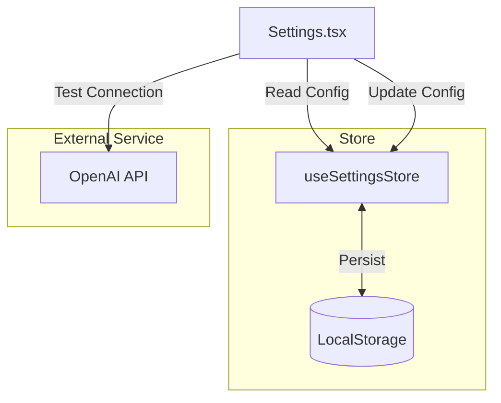

# Settings Page Documentation

## 1. 概览 (Overview)

Settings 页面 (`src/pages/Settings.tsx`) 是系统的核心配置中心，采用了与 Home 页面一致的 **"Digital Analog" (数字模拟/工程草图)** 设计风格。它允许用户配置 AI 服务的连接参数（如 OpenAI API Key、Base URL 和模型名称），这些配置直接决定了应用的智能功能是否可用。

页面核心目标：
*   **安全配置**：输入并安全存储 API 密钥（LocalStorage）。
*   **连接测试**：提供实时的 API 连通性测试功能。
*   **隐私透明**：明确告知用户数据的存储方式和隐私政策。

---

## 2. 视觉与布局 (Visual & Layout)

*   **视觉风格**:
    *   **背景**: `paper-surface` 纸质纹理背景。
    *   **边框**: `border-sketch` 手绘风格边框，用于包裹配置卡片。
    *   **字体**: 标题使用 `Playfair Display`，正文使用 `Montserrat`，强调手绘与笔记感。
    *   **图标**: 大量使用 `lucide-react` 图标（Server, Wifi, ShieldCheck, Sparkles）增强视觉隐喻。

*   **布局**:
    *   **Navigation**: 复用全局导航栏。
    *   **Header**: 页面标题与简短说明。
    *   **Config Card**: 居中显示的表单卡片，包含所有配置项。

---

## 3. 数据架构 (Data Architecture)

Settings 页面的数据流主要围绕 `useSettingsStore` 进行，该 Store 利用 `zustand/middleware/persist` 将数据持久化到浏览器的 `localStorage`。



### 3.1 核心状态
*   `apiKey`: OpenAI API Key (或兼容服务的 Key)。
*   `baseUrl`: API 基础路径 (e.g., `https://api.openai.com/v1`).
*   `model`: 使用的模型名称 (e.g., `gpt-3.5-turbo`).

---

## 4. 功能模块详解 (Features)

### 4.1 表单配置 (Configuration Form)
*   **Base URL**:
    *   支持自定义 API 端点。
    *   **安全校验**: 会自动检测并拦截指向当前前端站点的 URL (`isSameOriginAsApp`)，防止用户误填导致请求死循环。
    *   自动规范化 URL (移除末尾斜杠等)。
*   **API Key**:
    *   **隐私保护**: 默认掩码显示 (`password` type)，提供 "Eye" 按钮切换可见性。
    *   **本地存储**: 明确提示 Key 仅存储在本地。
*   **Model**:
    *   支持自定义模型名称。

### 4.2 连接测试 (Test Connection)
*   **触发**: 点击 "Test Connection" 按钮。
*   **逻辑**:
    1.  使用当前表单数据实例化临时的 `OpenAI` 客户端。
    2.  发送一个极简的 Chat Completion 请求 (`messages: [{ role: "user", content: "hi" }]`)。
    3.  根据响应结果显示 Success Toast 或 Error Toast。
*   **反馈**: 测试过程中按钮显示 Loading Spinner。

### 4.3 保存 (Save)
*   使用 `react-hook-form` + `zod` 进行表单验证。
*   验证通过后，调用 `setSettings` 更新 Store。
*   更新成功显示 Toast 提示。

---

## 5. 代码片段示例 (Code Implementation)

### 连接测试逻辑
```typescript
// src/pages/Settings.tsx

const handleTestConnection = async () => {
  // 1. 验证表单
  const isValid = await form.trigger();
  if (!isValid) return;

  const values = form.getValues();
  // ...URL 规范化校验

  setIsTesting(true);
  try {
    // 2. 实例化客户端
    const client = new OpenAI({
      apiKey: values.apiKey,
      baseURL: normalizedBaseUrl,
      dangerouslyAllowBrowser: true,
    });

    // 3. 发送测试请求
    await client.chat.completions.create({
      model: values.model,
      messages: [{ role: "user", content: "hi" }],
    });

    toast.success("连接成功，模型可用");
  } catch (err) {
    toast.error(`连接失败: ${formatClientError(err)}`);
  } finally {
    setIsTesting(false);
  }
};
```
